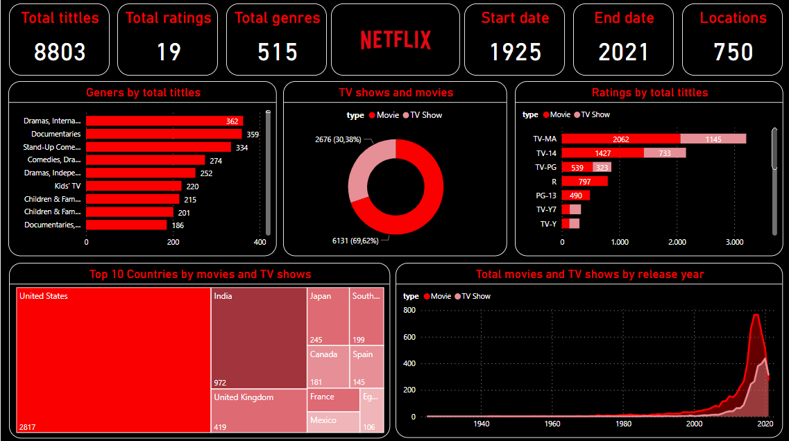

# Dashboard_Netflix
Panel de Control sobre Netflix

## Introducción

Proyecto de una serie de prácticas realizadas con Power BI sobre diferentes plataformas de servicio de streaming.

## Explicación

Este proyecto consiste en obtener un Panel de Control con los datos de streaming de Netflix. Estos datos cuenta con la información sobre la que hay disponibles en la plataforma.

[Archivo Excel Original](https://github.com/ntr94/Dashboard_Netflix/blob/main/netflix_titles.csv)

## Panel de control

## Dashboard relacionados

[Prime Video](https://github.com/ntr94/Dashboard_PrimeVideo)

[Disney Plus](https://github.com/ntr94/Dashboard_Disney_plus)
